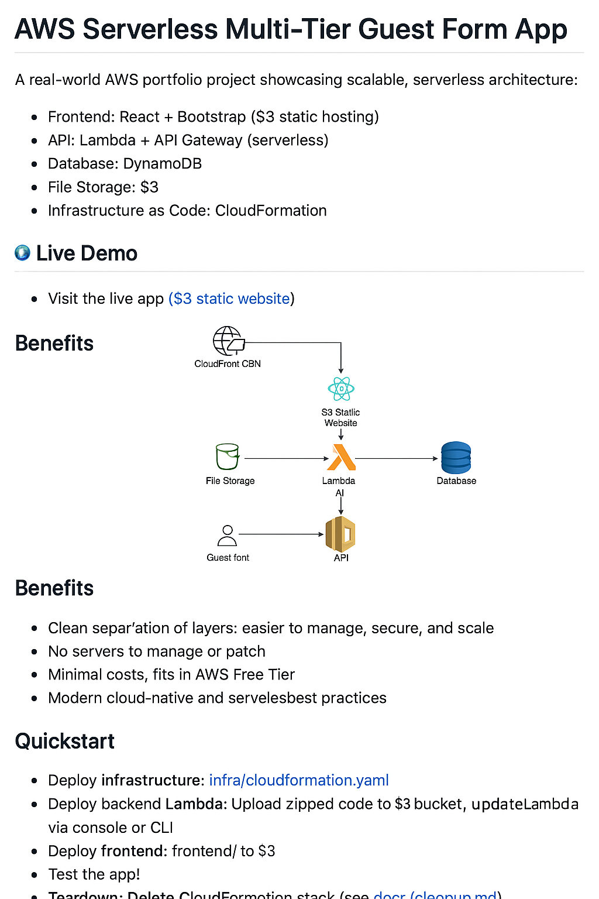

# AWS Serverless Multi-Tier Guest Form App

A real-world AWS portfolio project showcasing scalable, serverless architecture:

### ⚙️ Architecture Overview

- **Frontend**: React + Bootstrap (S3 static hosting, served via CloudFront)
- **API**: Lambda + API Gateway (serverless REST endpoints)
- **Database**: DynamoDB (PAY_PER_REQUEST)
- **File Storage**: S3 (uploads with pre-signed URLs optional)
- **Infrastructure as Code**: CloudFormation (reproducible IaC)

---

## 🧭 Architecture Diagram



---

## 🌐 Live Demo

✅ [Visit the live app (CloudFront-hosted)](https://d2y89h5kncs5ch.cloudfront.net/)

---

## ✅ Benefits

- **Separation of concerns**: Each layer (frontend, API, database, storage) is managed independently
- **Security**: Business logic and sensitive data are protected in backend tiers
- **Scalability**: Lambda and API Gateway scale on demand; S3 scales automatically
- **Resilience**: No single point of failure; fully managed by AWS
- **Cost-Effective**: Pay-per-use model; eligible under AWS Free Tier
- **Global Performance**: CloudFront CDN caches content at edge locations
- **HTTPS Security**: CloudFront provides SSL/TLS encrypted access
- **DDoS Protection**: AWS Shield Standard defends against common attacks
- **Caching**: CloudFront caches static files for faster load speeds

> This architecture pattern is widely used by modern enterprise apps serving global traffic.

---

## 🚀 Quickstart

1. **Deploy infrastructure**:

   ```bash
   aws cloudformation deploy \
     --template-file infra/cloudformation.yaml \
     --stack-name guest-app-stack \
     --capabilities CAPABILITY_IAM
   ```

2. **Package & Upload Backend Lambda**:

   ```bash
   zip backend-lambda.zip index.js
   aws s3 cp backend-lambda.zip s3://guestbucket-lc/
   aws lambda update-function-code \
     --function-name guest-app-api \
     --s3-bucket guestbucket-lc \
     --s3-key backend-lambda.zip
   ```

3. **Deploy Frontend to S3**:

   ```bash
   aws s3 sync ./frontend/ s3://<your-frontend-bucket> --delete
   ```

4. **Test the App**:

   - Visit CloudFront URL (see CloudFormation outputs)
   - Use `/guests` endpoint to register a guest

5. **Teardown**:

   - Delete the CloudFormation stack
   - See `docs/cleanup.md`

---

## 📄 Documentation

- 📘 `docs/benefits.md` — Detailed architectural and business benefits
- 💰 `docs/costs.md` — AWS service pricing estimates and Free Tier eligibility
- 🚀 `docs/deployment.md` — Full step-by-step deployment instructions
